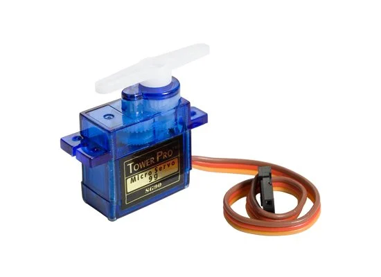
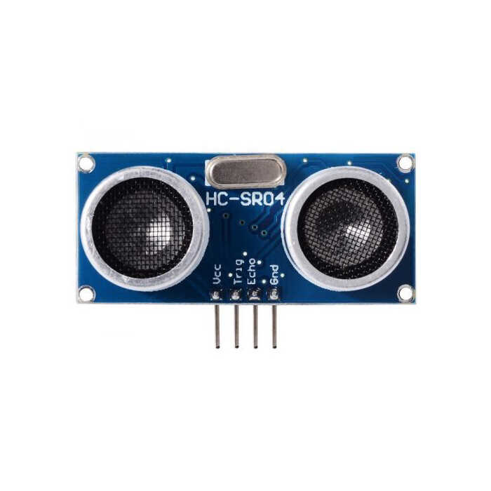
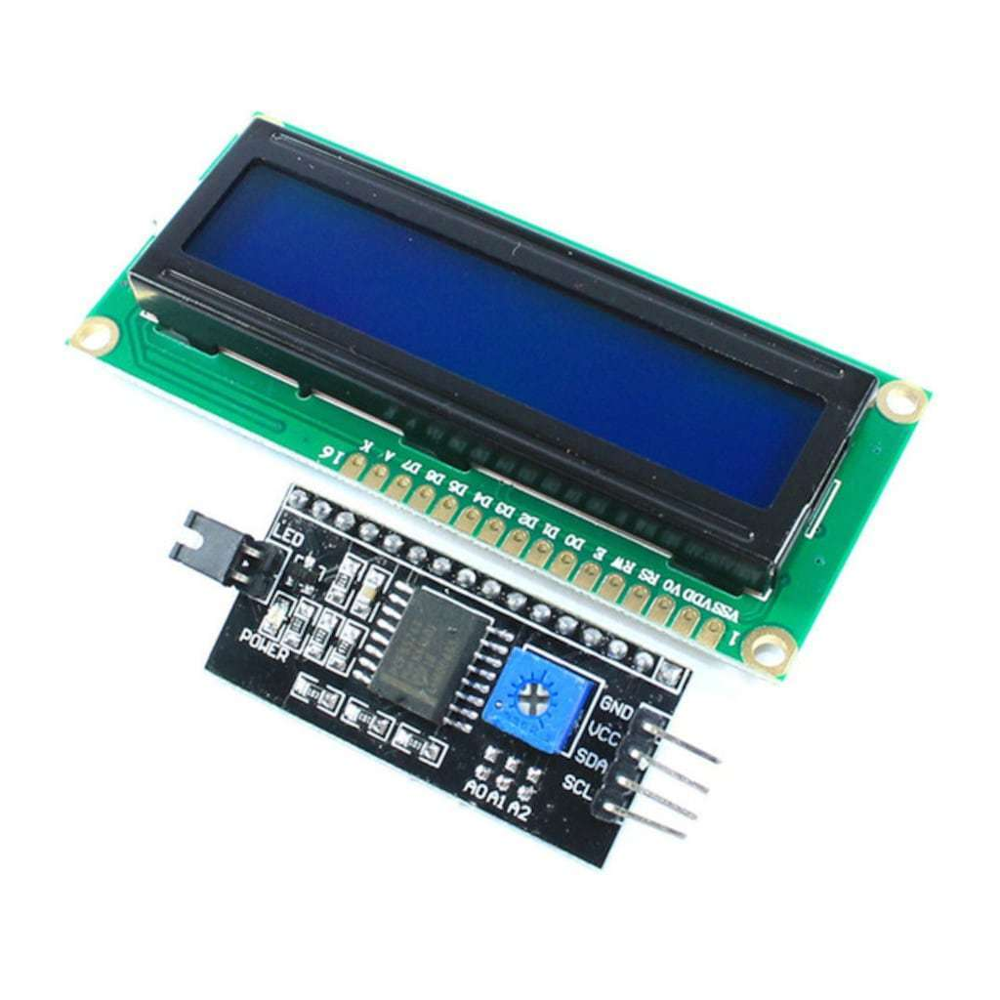

# Image-32
Arduino ve esp32 ile görüntü işleme

Bu projede esp32 tabanlı Wemos D1 R32 ve Arduino Uno kartları ile görüntü işleme teknikleri birleştirilmiştir.

# Gerekli kurulumlar

### Görüntü İşleme
##### Ultralytics üzerinden YOLOv8n modeli indirilir
- https://docs.ultralytics.com/tr/models/yolov8/#performance-metrics
Ardından VSCode bash üzerinde aşağıdaki kodlar çalıştırlır:
```cpp
# pip’i güncelle
pip install --upgrade pip

# YOLOv8 (Ultralytics)
pip install ultralytics==8.0.199

# OpenCV (Görüntü işleme)
pip install opencv-python==4.9.0.80

# NumPy (Sayısal işlemler)
pip install numpy==1.26.4

# PySerial (ESP32 ile haberleşme)
pip install pyserial==3.5

```

### Arduino IDE
Bu kütüphanelerin kurulumu Arduino IDE üzerinden Library Manager ile aratılarak bulunur.
-	ESP32Servo
-	LiquidCrystal_I2C
-	esp32 by Espressif (board manager)


# Özellikler

- [x] İnsan algılama (YOLOv8)
- [x] Renkli hedef belirleme
- [x] Servo açısı hesaplama


# Donanım

### Kullanılan sensörler ve parçalar:
#### SG90


#### HC-SR04


#### LED EKRAN 16X2

#### Breadboard

Aynı anda Python ve C++ kodları kullanılmıştır fakat asıl odaklanılan kısım görüntü işleme kodlarıdır.
